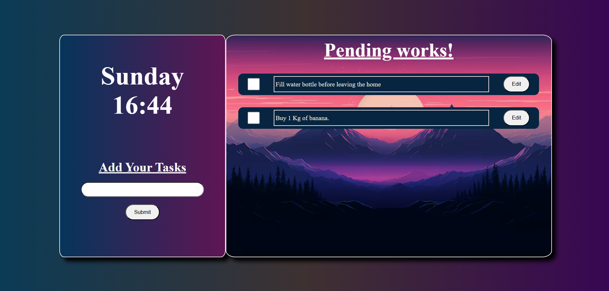
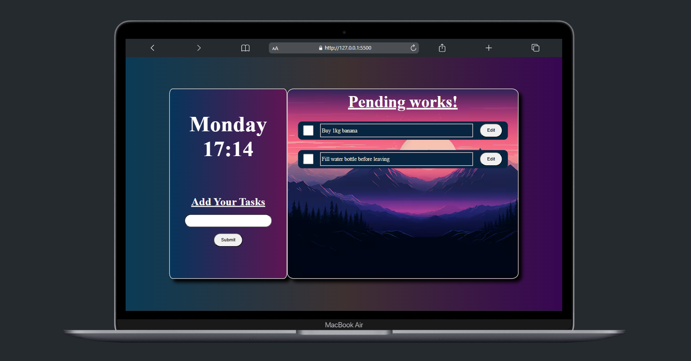
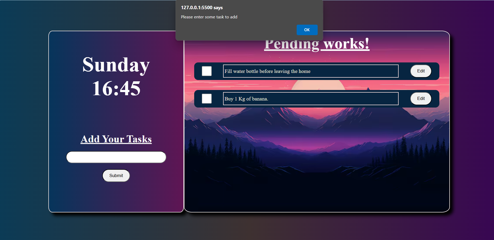
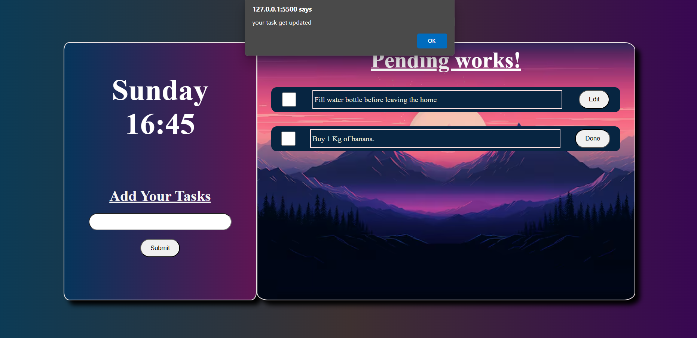
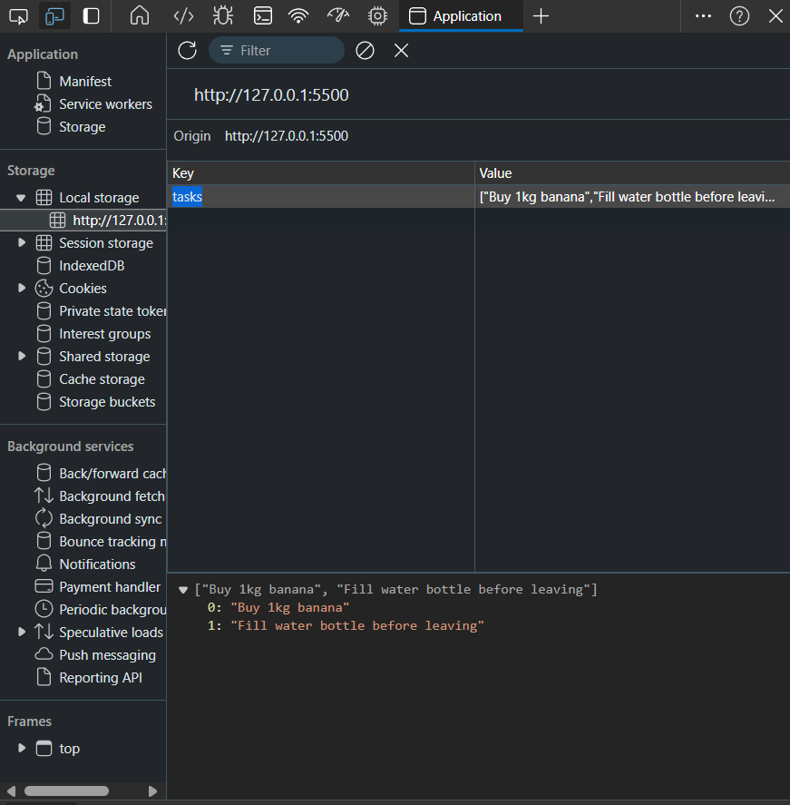
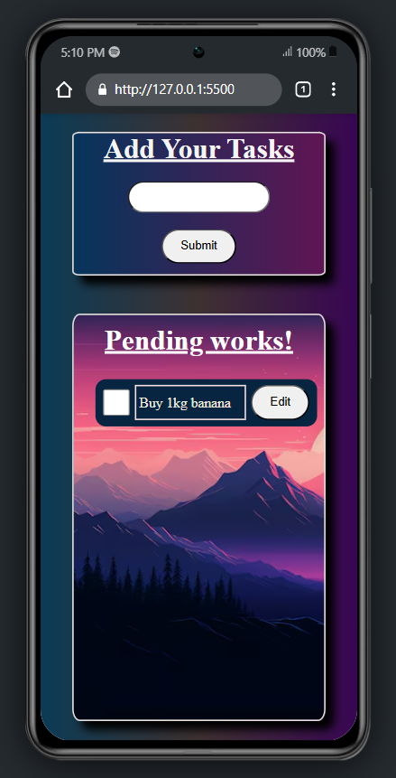
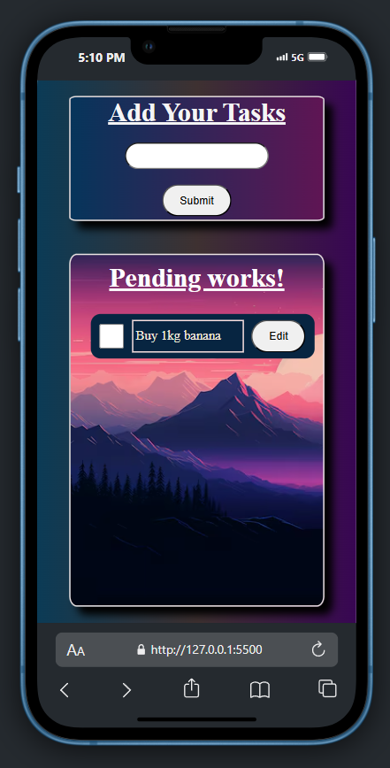
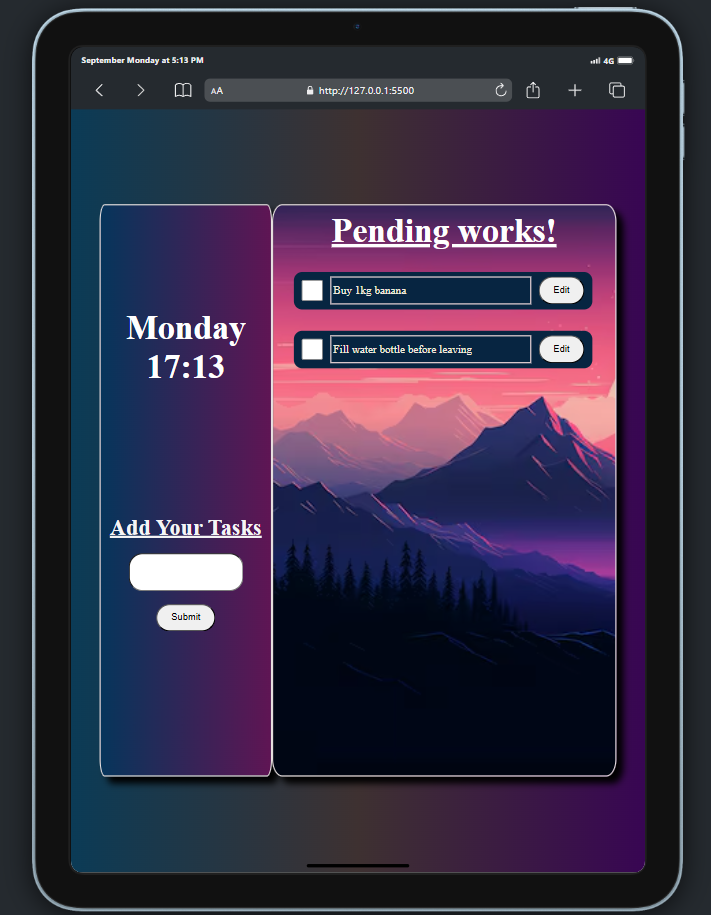

<h1 align="center">ToDo Application</h1>

TODO web application with HTML, CSS and JavaScript

## Table of Contents
* [Project Purpose](#project-purpose)
* [Technologies](#technologies)
* [Quick Tour](#quick-tour)
* [How to run the app](#how-to-run-the-app)

## Project Purpose

1. <h3>Practice DOM Manipulation</h3>: By dynamically adding, removing, and updating tasks on the to-do list, i gain hands-on experience in manipulating the Document Object Model (DOM) using JavaScript and jQuery.

2. <h3>Learn jQuery</h3>: The project allows me to explore jQuery, a popular JavaScript library, to simplify DOM interactions, handle events, and manage animations more efficiently compared to vanilla JavaScript.

3. <h3>Implement Local Storage</h3>: By storing the to-do list items in the browser's local storage, i learn how to persist data across page reloads, giving users a more consistent experience.

4. <h3>Enhance Front-End Skills</h3>: The project helps me improve my front-end development skills, including working with HTML for structure, CSS for styling, and JavaScript/jQuery for interactivity.

5. <h3>Develop a Functional Application</h3>: The to-do list is a practical application that can be used to manage tasks, helping you understand the basics of creating usable and meaningful web applications.

## Technologies
* HTML5
* CSS3
* ECMAScript 2023
* jQuery
* LocalStorage

## Quick Tour
<h2 align="center">Home Page</h2>

    

<h2 align="center">Special view</h2>

    

<h2 align="center">Warnings</h2>

    
    

<h2 align="center">Local Storage</h2>

    

<h2 align="center">Responsiveness</h2>

    
    

<h2 align="center">Tabs Responsiveness</h2>

    

## How to run the app
1. Download the code
2. Install live server if you don't have
3. Run the server

